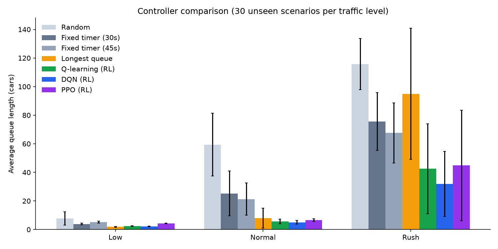
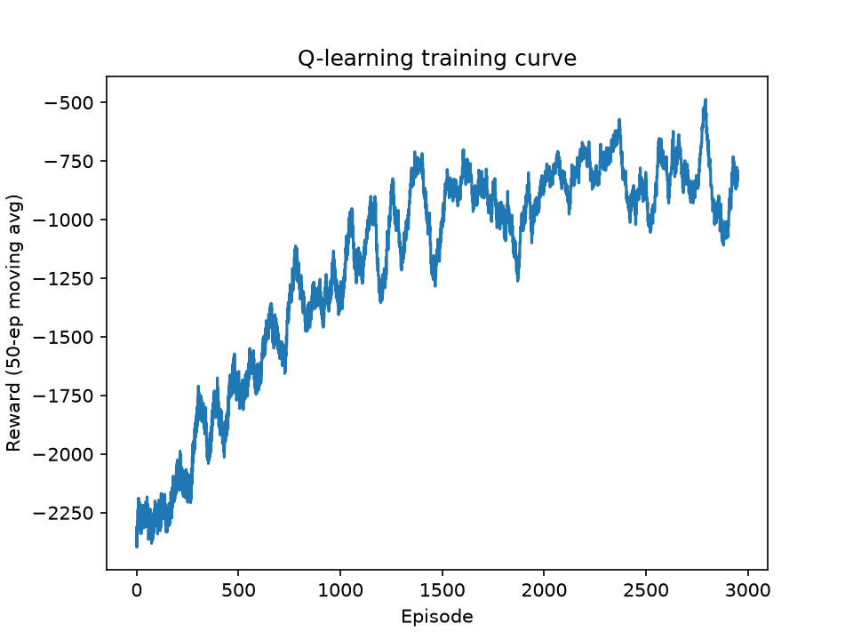

<div align="center">

# Smart Traffic Signal Control with Reinforcement Learning

**Q-learning, DQN and PPO agents that learn to run a four-way intersection, compared against classic controllers on identical traffic.**


*Course project, CAI-461 Reinforcement Learning, Fall 2026*

</div>

---

## Overview

Most traffic lights run on a fixed timer, so green time is wasted on an empty road while cars pile up on the other. This project builds a simulated intersection and trains reinforcement learning agents to choose the signal phase from the live queue lengths.

The repository contains the whole pipeline:

- a custom [Gymnasium](https://gymnasium.farama.org/) environment of a four-lane intersection,
- three RL agents (tabular Q-learning, DQN, PPO) and four non-learning baselines,
- a multi-seed evaluation script that produces the results tables and charts,
- a FastAPI backend and a React demo that replay any baseline against any RL agent side by side on the same traffic.

## Results

Each controller was tested on **30 unseen random scenarios per traffic level**. The table shows the **average queue length in cars (lower is better)**.

| Controller | Low | Normal | Rush |
|---|---:|---:|---:|
| Random | 7.7 | 59.4 | 115.8 |
| Fixed timer, 30 s | 3.9 | 25.2 | 75.6 |
| Fixed timer, 45 s | 5.3 | 21.3 | 67.6 |
| Longest queue first | **1.9** | 8.0 | 95.0 |
| Q-learning | 2.4 | 5.6 | 42.5 |
| **DQN** | 2.1 | **5.1** | **31.9** |
| PPO | 4.3 | 6.6 | 44.8 |

**Headline:** compared with the 30-second fixed timer, DQN lowered the average queue by about **80% in normal traffic** (5.1 vs 25.2) and about **58% in rush traffic** (31.9 vs 75.6).

<p align="center">
  
</p>

### What the numbers do not show

Reading the table honestly matters as much as the headline:

- In normal traffic Q-learning (5.6) and DQN (5.1) are within one standard deviation of each other, so there is **no clear winner** between them.
- In **low traffic the simple longest-queue-first rule is the best controller** (1.9), ahead of every RL agent.
- PPO is the weakest RL agent and trails the 30 s timer in low traffic. Each agent was trained once, with one seed and no hyperparameter search, so this may reflect the training rather than the algorithm.
- Results come from a simplified simulator (see [Limitations](#limitations)), not from real traffic.

## How it works

### Environment (`backend/env.py`)

| Item | Setting |
|---|---|
| Layout | One intersection, four lanes (N, S, E, W) |
| Phases | 2: north-south green or east-west green |
| Decision step | Every 5 s, 720 decisions per simulated hour |
| Yellow time | 3 s when the phase is switched |
| Discharge | Up to 0.5 cars per second from a green lane |
| Arrivals | Random each second, per lane; rate 0.08 (low), 0.14 (normal) or 0.20 (rush) multiplied by a random lane factor of 0.6 to 1.4 |
| Demand shift | The busy direction swaps at the half hour, so a fixed schedule cannot suit the whole run |
| Queue cap | 60 cars per lane |
| Observation | 7 values: 4 queue lengths, current phase (one-hot), time in phase |
| Reward | Negative sum of queue lengths over the 5 s step, minus a 0.3 penalty for each switch |

### Controllers

| Type | Controller | Idea |
|---|---|---|
| Baseline | Random | Picks a phase at random |
| Baseline | Fixed timer (30 s, 45 s) | Alternates phases on a fixed schedule |
| Baseline | Longest queue first | Serves the busier direction, with a 10 s minimum green |
| RL | Q-learning | Table over binned NS and EW queues, phase and time (`train_q.py`) |
| RL | DQN | Stable-Baselines3, MLP 64-64, 300,000 steps (`train_sb3.py`) |
| RL | PPO | Stable-Baselines3, MLP 64-64, 4 parallel environments (`train_sb3.py`) |

Deep agents are trained on a random traffic level each episode, and everything is evaluated on seeds that were never used in training.

### Training curve

<p align="center">
  
</p>

## Project structure

```
smart-traffic-rl/
├── backend/
│   ├── env.py              Gymnasium intersection environment
│   ├── baselines.py        Random, fixed timer, longest queue first, evaluate()
│   ├── train_q.py          Tabular Q-learning, writes q_table.npy
│   ├── train_sb3.py        DQN and PPO training, writes *_model.zip
│   ├── results.py          30-scenario evaluation, writes results.csv / .md / .png
│   ├── api.py              FastAPI simulation backend
│   ├── requirements.txt
│   ├── q_table.npy         Trained Q-table
│   ├── dqn_model.zip       Trained DQN
│   ├── ppo_model.zip       Trained PPO
│   └── results.*           Generated evaluation outputs
├── frontend/               React + TypeScript + Tailwind (Vite) demo
│   └── src/                App.tsx, Intersection.tsx, Chart.tsx, types.ts
└── report/
    ├── Traffic_RL_Report.docx
    └── Traffic_RL_Report.pdf
```

## Getting started

**Requirements:** Python 3.10+ and Node.js 18+. On Windows, PyTorch needs the Microsoft Visual C++ Redistributable installed.

### 1. Backend

```bash
cd backend
python -m venv venv
venv\Scripts\activate          # macOS / Linux: source venv/bin/activate
python -m pip install -r requirements.txt
```

If PyTorch is missing or too large, install the CPU build:

```bash
python -m pip install torch --index-url https://download.pytorch.org/whl/cpu
```

The trained models are already in the repository, so you can skip straight to running the API. To retrain or re-evaluate:

```bash
python train_q.py                       # Q-learning, about 3000 episodes
python train_sb3.py dqn 300000          # DQN
python train_sb3.py ppo 300000          # PPO
python results.py                       # 30 scenarios per level, writes results.*
```

Start the API:

```bash
python -m uvicorn api:app --port 8000
```

### 2. Frontend

In a second terminal:

```bash
cd frontend
npm install
npm run dev
```

Open **http://localhost:5173**.

## Demo

The demo runs a baseline and an RL agent on the same traffic and shows the lane queues, the signals and a waiting-cars chart as they play.

1. Pick a traffic level: Low, Normal or Rush.
2. Pick a baseline (Fixed timer 30 s, Longest queue first) and an RL agent (Q-learning, DQN or PPO).
3. Press play, change the speed, or drag the slider to any moment of the hour.

The percentage in the banner is for the single scenario on screen. The averages over 30 scenarios are in the table above.

### API

| Endpoint | Description |
|---|---|
| `GET /controllers` | Lists the controllers available, depending on which trained models exist |
| `GET /simulate?level=&seed=&controller=` | Runs one simulated hour and returns a frame every 5 s with queues, phase and total waiting cars |

Interactive docs are at `http://localhost:8000/docs` while the backend is running.

## Limitations

- One intersection with two phases, no turning lanes, pedestrians or emergency vehicles.
- Synthetic arrivals, not real traffic data. Queues are capped at 60 cars per lane, so extra arrivals are dropped.
- Not validated in a full traffic simulator such as SUMO.
- One trained model per algorithm, one seed and no hyperparameter tuning.

## Future work

- Train each agent with several seeds and report the spread.
- Test in SUMO on real road layouts.
- Tune DQN and PPO, and try other algorithms.
- Extend to several connected intersections and more phases.

## Documentation

The full write-up, with methods, tables and discussion, is in [`report/Traffic_RL_Report.pdf`](report/Traffic_RL_Report.pdf).

## Author

**Zehra Nisar**, BS Computer Science, UIT, for CAI-461 Reinforcement Learning.

## Acknowledgements

Built with [Gymnasium](https://gymnasium.farama.org/), [Stable-Baselines3](https://stable-baselines3.readthedocs.io/), [FastAPI](https://fastapi.tiangolo.com/), [React](https://react.dev/) and [Vite](https://vite.dev/).
